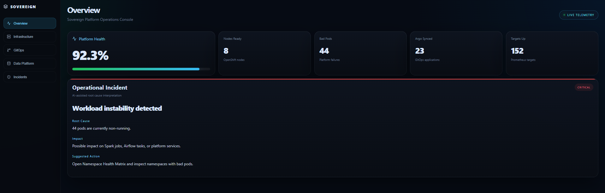

<div align="center">

# Sovereign Data Lakehouse Platform on OpenShift

### A GitOps-managed OpenShift data platform with a real-time fraud detection workload, an Iceberg lakehouse, Airflow orchestration, observability, and a custom operations console.

[](https://www.redhat.com/en/technologies/cloud-computing/openshift)
[](https://argo-cd.readthedocs.io/)
[](https://kafka.apache.org/)
[](https://spark.apache.org/)
[](https://iceberg.apache.org/)
[](https://trino.io/)
[](https://airflow.apache.org/)
[](https://www.vaultproject.io/)
[](LICENSE)

</div>

---

## What This Is

This repository is a working OpenShift data platform, not just a collection of manifests.

The platform is built around ArgoCD, OpenShift, Kafka, Spark, MinIO, Iceberg, Hive Metastore, Trino, Airflow, Vault, Prometheus, Thanos, Grafana, Superset, Apicurio Registry, and a custom React + FastAPI operations console.

The flagship workload is a real-time fraud detection pipeline using the IEEE-CIS Fraud Detection dataset. The workload takes raw transaction data, lands it into a bronze Iceberg layer, replays it through Kafka, processes it through Spark Structured Streaming, writes silver decisions, builds gold analytics through Airflow and Trino, and exposes the final state through dashboards, metrics, SQL, and a custom Platform Command Center.

The point of this project is not that every component is perfect. The point is that the platform was built, broken, debugged, validated, and documented like a real engineering system.

---

## Why I Built It

I wanted to build the full picture.

Not just a pipeline.  
Not just dashboards.  
Not just Kubernetes YAML.  

I wanted the whole path:

```text
Git -> ArgoCD -> OpenShift -> Kafka -> Spark -> Iceberg -> Trino -> Airflow -> Grafana/Superset -> Custom UI
```

Grafana was useful for metrics, but it was not enough as the main operational interface. So I built a custom Platform Command Center to show platform health, infrastructure status, GitOps state, fraud KPIs, and incident signals in one place.

---

## Architecture



The platform is organized into independent layers:

| Layer | Components |
|---|---|
| GitOps | ArgoCD / OpenShift GitOps |
| Runtime | OpenShift 4.21.7 |
| Streaming | Kafka KRaft via Strimzi |
| Processing | Spark 3.5.0 + Spark Operator |
| Lakehouse | MinIO + Apache Iceberg |
| Catalog | Hive Metastore |
| Query | Trino |
| Orchestration | Airflow |
| Schema | Apicurio Registry |
| Secrets | Vault + Vault Secrets Operator |
| Observability | Prometheus + Thanos + Grafana |
| BI | Superset |
| Operations | Custom React + FastAPI Platform Command Center |

---

## Validated Platform Metrics

These numbers come from the running environment validation, not from estimates.

| Metric | Value |
|---|---:|
| OpenShift version | 4.21.7 |
| Kubernetes version | v1.34.5 |
| Cluster size | 8 nodes |
| Node layout | 3 schedulable masters + 5 workers |
| ArgoCD applications | 27 |
| Kafka topics | 6 pipeline topics + 6 DLQ companions |
| Source transactions | 590,540 |
| Silver decisions | 994,376 rows |
| Silver transactions | 994,376 rows |
| Fraud cases detected | 34,391 |
| Average fraud rate | 3.60% |
| Blocked decisions | 7 |
| Gold daily fraud summaries | 182 rows |
| Gold UID risk profiles | 37,531 rows |
| Gold hourly fraud patterns | 24 rows |
| Gold rule performance rows | 8 |
| Airflow DAGs | 5 |
| Prometheus alerting rules | 12 |

Kafka and silver counts are higher than the original source row count because replay and validation runs were used while testing the workload.

---

## Current Validation State

This is a lab platform under active development. The core data platform is running and the fraud workload is populated, but the cluster is not presented as a fake “everything is green” screenshot.

| Area | Current State |
|---|---|
| Core platform namespaces | Main workloads are running |
| OpenShift nodes | 8/8 Ready |
| Kafka | Cluster Ready with all 12 topics present |
| Trino | Running and querying bronze/silver/gold Iceberg schemas |
| Airflow | Scheduler, API server, and DAG processor running; 5 DAG files present |
| Grafana | Running |
| Superset | Running |
| Platform Command Center | Frontend and backend running; live API traffic confirmed |
| ArgoCD | 27 apps declared; several apps still show active-development drift |
| Rook-Ceph | Storage components running, but ArgoCD app currently degraded |
| Vault | Vault and auth resources healthy; several VaultStaticSecret sync resources still require follow-up |
| Wider lab cluster | Some non-platform OpenShift system pods are in transitional states |

This is intentional documentation honesty: the platform works, but the repo also records the rough edges that came from building it on a real cluster.

---

## Repository Layout

```text
OpenShift-ArgoCD/
|
├── apps/
│   ├── root.yaml
│   ├── kafka.yaml
│   ├── spark.yaml
│   ├── airflow.yaml
│   ├── monitoring.yaml
│   ├── vault.yaml
│   ├── platform-command-ui.yaml
│   └── ...
│
├── platform/
│   ├── kafka/
│   ├── hive-metastore/
│   ├── trino/
│   ├── airflow/
│   ├── monitoring/
│   ├── platform-command-ui/
│   ├── vault/
│   ├── superset/
│   └── ...
│
├── fraud-platform/
│   ├── schemas/
│   │   ├── avro/
│   │   └── iceberg/
│   ├── spark-jobs/
│   │   ├── phase2/
│   │   ├── phase3/
│   │   └── phase4/
│   ├── dags/
│   ├── fraud-exporter/
│   └── k8s/
│
└── docs/
    ├── diagrams/
    ├── screenshots/
    └── validation/
```

Design rule: a new platform component should have one ArgoCD Application under `apps/` and its manifests or Helm values under `platform/`.

---

## Data Flow


A transaction moves through the system like this:

1. IEEE-CIS CSV data is loaded into a bronze Iceberg table.
2. Bronze data is replayed into Kafka as Avro messages.
3. Spark validates the raw transaction stream.
4. Spark enriches the stream with reference context.
5. Spark applies rule-based fraud scoring.
6. Spark converts scores into APPROVE, REVIEW, or BLOCK decisions.
7. Airflow writes processed decisions into silver Iceberg tables.
8. Airflow gold DAGs run Trino SQL to materialize analytics.
9. Trino, Superset, Grafana, Prometheus, and the Platform Command Center consume the result.

---

## Kafka Topics

The pipeline uses 6 primary topics and 6 DLQ companions.

```text
transactions-raw
transactions-raw-dlq

transactions-validated
transactions-validated-dlq

transactions-enriched
transactions-enriched-dlq

fraud-scores
fraud-scores-dlq

fraud-decisions
fraud-decisions-dlq

audit-trail
audit-trail-dlq
```

The DLQ design is part of the pipeline architecture. DLQ counts should be validated with a proper consumer group or offset-based check before being used as a published metric.

---

## Fraud Pipeline

The streaming workload is split into four Spark Structured Streaming jobs.

| Job | Input | Output | Purpose |
|---|---|---|---|
| Validation | `transactions-raw` | `transactions-validated` | Schema enforcement, type cleanup, invalid-record isolation |
| Enrichment | `transactions-validated` | `transactions-enriched` | Adds card, device, merchant, and risk context |
| Scoring | `transactions-enriched` | `fraud-scores` | Applies rule-based fraud scoring |
| Decision | `fraud-scores` | `fraud-decisions`, `audit-trail` | Emits final decision and audit trail |

Fraud signals include:

| Signal | Purpose |
|---|---|
| `high_amount` | Detects unusually large transactions |
| `velocity` | Detects repeated activity patterns |
| `night_tx` | Flags late-night transaction behavior |
| `card_mismatch` | Flags card and billing inconsistencies |
| `product_h` | Captures product-category risk |
| `c13_spike` | Detects anomaly patterns in the C13 field |
| `anonymous_email` | Flags anonymous or suspicious email patterns |
| `cent_pattern` | Detects suspicious amount-ending behavior |

This is rule-based fraud scoring, not a claimed production ML model.

---

## Lakehouse Tables

Trino validated the following Iceberg schemas:

```text
warehouse_bronze
warehouse_silver
warehouse_gold
```

Validated table counts:

| Layer | Table / Output | Rows |
|---|---|---:|
| Bronze | `warehouse_bronze.transactions` | 590,540 |
| Silver | `warehouse_silver.decisions` | 994,376 |
| Silver | `warehouse_silver.transactions` | 994,376 |
| Gold | `warehouse_gold.daily_fraud_summary` | 182 |
| Gold | `warehouse_gold.uid_risk_profile` | 37,531 |
| Gold | `warehouse_gold.hourly_fraud_pattern` | 24 |
| Gold | `warehouse_gold.rule_performance` | 8 |

---

## Lambda Architecture



The workload follows a Lambda-style architecture:

| Layer | Purpose |
|---|---|
| Speed layer | Kafka and Spark Structured Streaming process transaction events |
| Batch layer | Airflow and Trino build scheduled gold-layer analytics |
| Serving layer | Trino, Superset, Grafana, Prometheus, and the Platform Command Center expose the results |

This keeps real-time decisioning separate from heavier analytical aggregation.

---

## GitOps Delivery



The platform uses an ArgoCD App of Apps model.

The intended bootstrap entry point is:

```bash
oc apply -f apps/root.yaml
```

The root application points at the `apps/` directory. Child applications then deploy individual platform components.

Current validation found 27 ArgoCD Application manifests in `apps/`.

Important note: this repository is still an active engineering environment. Some ArgoCD applications may appear OutOfSync, Progressing, Missing, or Degraded while components are being rebuilt, excluded, or iterated on. The docs call this out instead of hiding it.

---

## Platform Command Center



The Platform Command Center is a custom operational UI built with React and FastAPI.

It exists because Grafana was not enough for the full operational story.

Grafana is good at metrics panels.  
The Command Center is built for platform operations.

It includes:

| View | Purpose |
|---|---|
| Overview | Platform health, cluster signals, bad pods, synced apps, and incident summary |
| Infrastructure | Component topology and namespace health |
| GitOps | ArgoCD application sync and health visibility |
| Data Platform | Fraud KPIs and pipeline-stage visualization |
| Incidents | Operational issue detection from live signals |

The backend queries cluster and monitoring data, while the frontend presents the state as an operator-facing interface.

Validation confirmed both frontend and backend pods were running, and the backend was serving live API traffic for overview, namespaces, ArgoCD apps, topology, events, and incidents.

---

## Observability

The platform uses OpenShift User Workload Monitoring, Prometheus, Thanos, Grafana, and a custom fraud metrics exporter.

The exporter queries Trino gold tables and exposes business metrics as Prometheus metrics.

Validated exporter metrics include:

| Metric | Value |
|---|---:|
| `fraud_total_transactions_all` | 994,376 |
| `fraud_total_fraud_count_all` | 34,391 |
| `fraud_avg_fraud_rate_all` | 0.0360 |
| `fraud_total_blocked_all` | 7 |
| `fraud_silver_decisions_count` | 994,376 |
| `fraud_silver_transactions_count` | 994,376 |

Product-level fraud rates were also exposed for products C, S, H, R, and W.

---

## Security and Secrets

Credentials are intentionally excluded from this repository.

The platform includes Vault and Vault Secrets Operator resources for GitOps-managed secret delivery.

Current validation showed:

- Vault pod running
- Vault service and route present
- VaultConnection healthy
- VaultAuth healthy
- several VaultStaticSecret resources still requiring follow-up

That means the secret-management architecture is present, but the current lab state is not documented as fully clean.

Runtime credentials, private routes, tokens, and passwords are not published.

---

## Engineering Notes

Some of the most important problems solved while building this:

- external image pull issues from cluster network paths
- building and pushing Spark images into the OpenShift internal registry
- Spark / Hive Metastore compatibility issues
- S3A write behavior against MinIO
- ArgoCD re-applying one-shot Spark jobs
- SparkApplication CPU validation behavior
- Schema Registry calls causing performance bottlenecks when done per row
- Airflow 3.x operational changes
- Trino SQL and Iceberg schema mismatch during gold table writes
- Grafana Operator plugin limitations that led to building the custom Command Center

The dirty parts matter. They are the part that proves the system was actually built.

---

## Bootstrap

### Prerequisites

- OpenShift 4.x cluster
- `oc` CLI authenticated as a user with sufficient privileges
- OpenShift GitOps Operator installed
- Required storage classes available
- Required secrets provisioned through Vault or Kubernetes Secrets before dependent workloads start

### Deploy

```bash
git clone https://github.com/bakralakhras/OpenShift-ArgoCD.git
cd OpenShift-ArgoCD

oc adm policy add-cluster-role-to-user cluster-admin \
  -z openshift-gitops-argocd-application-controller \
  -n openshift-gitops

oc apply -f apps/root.yaml
```

Watch convergence:

```bash
watch oc get applications -n openshift-gitops
```

---

## Validation Commands

Check ArgoCD applications:

```bash
oc get applications -n openshift-gitops
```

Check nodes:

```bash
oc get nodes -o wide
```

Check Kafka topics:

```bash
oc get kafkatopics -n kafka
```

Check Airflow DAG files:

```bash
oc exec -n airflow sts/airflow-scheduler -- \
  bash -lc 'ls -lah /opt/airflow/dags'
```

Check Trino tables:

```bash
TRINO_POD=$(oc get pod -n trino -o jsonpath='{.items[0].metadata.name}')

oc exec -n trino "$TRINO_POD" -- \
  trino --execute "SELECT count(*) FROM iceberg.warehouse_bronze.transactions"

oc exec -n trino "$TRINO_POD" -- \
  trino --execute "SELECT count(*) FROM iceberg.warehouse_silver.decisions"

oc exec -n trino "$TRINO_POD" -- \
  trino --execute "SELECT * FROM iceberg.warehouse_gold.daily_fraud_summary ORDER BY summary_date DESC LIMIT 5"
```

Check Platform Command Center route:

```bash
oc get route -n platform-command-ui
```

---

## Documentation

| Document | Purpose |
|---|---|
| [`docs/01-platform-architecture.md`](docs/01-platform-architecture.md) | Platform architecture and component responsibilities |
| [`docs/02-fraud-data-flow.md`](docs/02-fraud-data-flow.md) | End-to-end fraud pipeline data flow |
| [`docs/03-lambda-architecture.md`](docs/03-lambda-architecture.md) | Speed, batch, and serving layer design |
| [`docs/04-gitops-delivery.md`](docs/04-gitops-delivery.md) | ArgoCD App of Apps and current drift notes |
| [`docs/05-command-center-ui.md`](docs/05-command-center-ui.md) | Custom operations console design |
| [`docs/06-observability.md`](docs/06-observability.md) | Metrics, alerts, exporter, and dashboards |
| [`docs/07-security-and-secrets.md`](docs/07-security-and-secrets.md) | Vault and secret delivery model |
| [`docs/08-troubleshooting-and-lessons.md`](docs/08-troubleshooting-and-lessons.md) | Engineering issues and lessons learned |
| [`docs/09-demo-guide.md`](docs/09-demo-guide.md) | Demo walkthrough and verification commands |
| [`docs/10-screenshots.md`](docs/10-screenshots.md) | Screenshot gallery guide |
| [`docs/11-validation-summary.md`](docs/11-validation-summary.md) | Validated claims and known gaps |

---

## Project Status

This project is packaged as a platform engineering case study.

Current state:

- OpenShift cluster running with 8 Ready nodes
- GitOps repo contains 27 ArgoCD applications
- Kafka event bus running with pipeline and DLQ topics
- Trino can query bronze, silver, and gold Iceberg schemas
- Fraud pipeline data is populated through silver and gold layers
- Airflow DAG files are deployed
- Grafana and Superset are running
- Fraud metrics exporter exposes business metrics
- Platform Command Center is deployed and serving live API traffic
- Some GitOps, VaultStaticSecret, Rook-Ceph, and wider cluster states still require cleanup

This is the current engineering truth of the platform.

---

## Author

**Baker Al-Akhras**  
Data & Platform Engineer

[LinkedIn](https://www.linkedin.com/in/bakr-alakhras/) · [GitHub](https://github.com/bakralakhras) · [Portfolio](https://bakralakhras.github.io/portfolio/)

---

<div align="center">

Built as a flagship platform engineering project demonstrating end-to-end ownership of an OpenShift data platform: GitOps, streaming, lakehouse storage, orchestration, observability, and custom platform operations.

</div>
