# Fraud Data Flow

## Overview

The fraud workload processes the IEEE-CIS Fraud Detection dataset through a real streaming and lakehouse pipeline.

The workload is not framed as a production fraud product. It is a platform workload used to prove that the OpenShift data platform can run a realistic end-to-end data flow.

---

## Data Flow Diagram



---

## Validated Counts

| Output | Count |
|---|---:|
| Bronze source transactions | 590,540 |
| Silver decisions | 994,376 |
| Silver transactions | 994,376 |
| Fraud cases detected | 34,391 |
| Average fraud rate | 3.60% |
| Blocked decisions | 7 |
| Daily gold summaries | 182 |
| UID risk profiles | 37,531 |
| Hourly fraud patterns | 24 |
| Rule performance rows | 8 |

Kafka and silver counts are higher than the source dataset because replay and validation runs were used while testing the platform.

---

## End-to-End Path

```text
IEEE-CIS CSV
    |
    v
Bronze Iceberg
    |
    v
Kafka transactions-raw
    |
    v
Spark validation
    |
    v
Kafka transactions-validated
    |
    v
Spark enrichment
    |
    v
Kafka transactions-enriched
    |
    v
Spark scoring
    |
    v
Kafka fraud-scores
    |
    v
Spark decisioning
    |
    v
Kafka fraud-decisions + audit-trail
    |
    v
Silver Iceberg
    |
    v
Airflow + Trino gold builders
    |
    v
Gold Iceberg
    |
    v
Trino / Grafana / Superset / Command Center / Prometheus exporter
```

---

## Kafka Topic Model

Validated Kafka topics:

```text
audit-trail
audit-trail-dlq
fraud-decisions
fraud-decisions-dlq
fraud-scores
fraud-scores-dlq
transactions-enriched
transactions-enriched-dlq
transactions-raw
transactions-raw-dlq
transactions-validated
transactions-validated-dlq
```

The topic architecture includes DLQ companions for every major pipeline stage.

A quick console-consumer validation returned one line per DLQ topic. That result should not be treated as a published DLQ metric without a cleaner offset-based check, so the README avoids claiming zero DLQ messages.

---

## Spark Stages

| Stage | Input | Output | Purpose |
|---|---|---|---|
| Validation | `transactions-raw` | `transactions-validated` | Clean raw stream and isolate invalid records |
| Enrichment | `transactions-validated` | `transactions-enriched` | Add risk context |
| Scoring | `transactions-enriched` | `fraud-scores` | Apply fraud scoring rules |
| Decision | `fraud-scores` | `fraud-decisions`, `audit-trail` | Emit operational decision and audit record |

---

## Silver Decision Schema

Validated silver decision fields include:

```text
transactionid
uid
transactionamt
productcd
card4
card6
p_emaildomain
transaction_hour
fraud_score
decision
decision_reason
model_version
rules_triggered
isfraud
ingestion_id
transaction_date
```

---

## Example Decision Records

Sample decisions showed APPROVE outcomes with fraud scores, decision reasons, model version, rules triggered, fraud label, ingestion ID, and transaction date.

This proves that the silver layer is not just row counts; it contains structured transaction-level decision records.
